Back in November, I downloaded and analyzed a sample of what I thought was Phorpiex;
however, shortly after sharing the post around, [Struppigel](https://x.com/struppigel)
pointed out that what I analyzed may in fact not be Phorpiex; thus, here we are.
So today, we will be taking a look at the Phorpiex (also known as Trik) sample... again.

Trik is a botnet that started out some time in the 2010s, known for its spam campaigns,
sextortion, and other malware delivery such as Lockbit Black. The sample is, as already
mentioned, relatively old, so it shouldn't be too hard to analyze, so let's take a look at it.

If you want to try and reverse it yourself, you can download it here.

```txt
https[:]//malshare[.]com/sample.php?action=detail&hash=b45c7ac7e1b7bbc32944c01be58d496b5e765a90bd4b1026855dd44cea28cd12
```

# Technical Details

Throwing the binary into VT (VirusTotal), we see 60 out of 73 detections along with some
interesting tags.

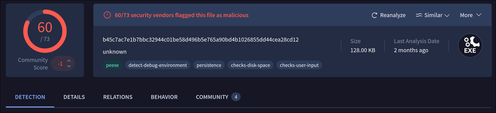

From scrolling around a little, we find the file was compiled on the 7th of February 2016
for i386 or later. However, that is not that interesting; let's check out the strings. There
are a lot of them, so I will try to keep it short. The strings can be sorted into

6 groups:

1. Registry & Filesystem
2. Networking
3. Batch Script
4. Credentials
5. Last and First Names
6. Anti-VM/Anti-Sandbox

Under the first category, we will find stuff targeting the Windows firewall, the run key,
as well as Windows Defender and device paths. Other than that, the small category only
consists of format strings and the following two strings:

```txt
C:\Users\x\Desktop\Home\Code\Trik v1.7 - Work\Release\Trik.pdb
C:\Users\dade\Malware_Tools\API Monitor\apimonitor-drv-x86.sys
```

Cool, so we are working with Trik v1.7. It seems the malware author is likely censored with
the "x"; however, the other user, "dade" could also be one of the authors, though we cannot
confirm this, so we are just gonna move on!

Next up, networking. Again, a lot of format strings; however, we can also see some domains
and email addresses:

```txt
http://icanhazip.com/
hi@zmail.ru
qmail@
smtpcheck@Safe-mail.net
220.181.87.80
http://api.wipmania.com/
hotmail.com
```

Additionally, there are a lot of templates for emails as well as plaintext strings for protocols such as
SMTP, IRC, FTP, and, by the looks of it, even HTTP.

```txt
Received: from %s ([%d.%d.%d.%d]) by %s with MailEnable ESMTP; %s
Received: (qmail %s invoked by uid %s); %s
Dear Customer
to see more details about your order please open the attachment and reply as soon as possible.
Thank you,
AWG Customer Service
Subject: hi
From: hi@zmail.ru
To: smtpcheck@Safe-mail.net
Document #
Your Document #
Order #
Your Order #
Invoice #
Payment #
Payment Invoice #
Mozilla/5.0 (Windows NT 6.1; WOW64; rv:22.0) Gecko/20100101 Firefox/22.0
```

Next up, we have the names and credentials, nothing special there, just some
names for generating the emails and credentials for bruteforcing something. After
that we got the Anti-VM/Anti-Sandbox stuff:

```txt
qemu
virtual
vmware
\.\PhysicalDrive0
SbieDll.dll
SbieDllX.dll
```

Great, so by the looks of it, it tries to detect if it's running in a VM by opening
a handle to the first physical drive, and the sandbox check is just a check for simple
DLL by the looks of it. Finally, we have a batch script that, by the looks of it,
deletes a specified file. Now that that's out of the way, we can move on to the fun
stuff: static analysis!

## And for my Next (Anti-VM) Trik...

Throwing the sample in IDA, we land at the good old `WinMain`, the first thing this
thing does is sleep for 500 ms and then create a mutex `w6` to, of course, prevent
the sample from having multiple instances on the same host.

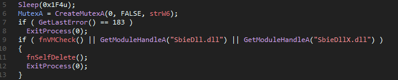

Next up we have the sandbox and VM checks; for this, the sample checks for common
DLLs related to sandboxes and then performs a VM check:

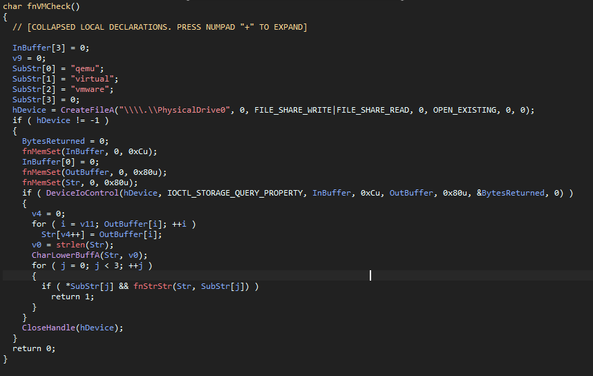

How it basically works is it opens a handle to the device `\\.\PhysicalDrive0`,
which is usually the main drive of the computer; it then requests the properties
of the storage device with `IOCTL_STORAGE_QUERY_PROPERTY`, after that is out of
the way it checks the output for identifiers like `qemu`, `vmware` or whatever,
if it finds a match, it returns `1`, which results in the main jumping into the
self-deletion procedure, which just creates a batch script that deletes our binary:

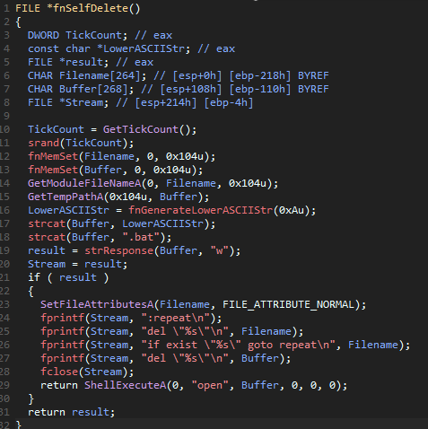

Anyway, after that mess, it attempts to remove its Mark of The Web (MoTW) from
the current directory. Once that is done, it tries to copy itself under one of
three directories: `%WINDIR%`, `%USERPROFILE%`, `%TEMP%` under the folder
`M-50504503224255244048500220524542045\winsvc.exe`. If it already exists in one
of the directories, or it successfully copies itself to said directories, it
will break out of the little for loop and continue with the execution:

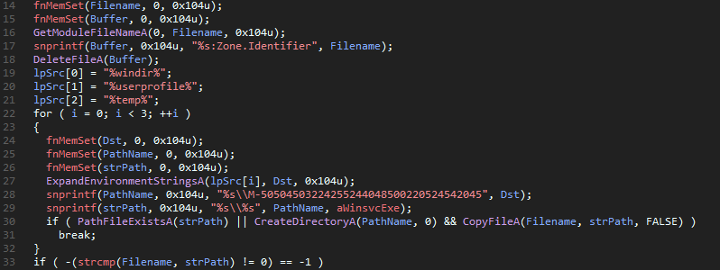

> [!INFO]
> **_What is a MoTW?_** Well to spare ya some time, here is what [Wikipedia](https://en.wikipedia.org/wiki/Mark_of_the_Web) says:
>
> The Mark of the Web (MoTW) is a metadata identifier used by Microsoft Windows
> to mark files downloaded from the Internet as potentially unsafe. Although its
> name specifically references the Web, it is also sometimes added to files from
> other sources perceived to be of high risk, including files copied from NTFS-
> formatted external drives that were themselves downloaded from the web at some
> earlier point.

Next up, it checks if it is running from the last path it was on in the previous
for-loop; if that is not the case, we jump into the if-condition. What does that
do? It first creates a template string for the following registry entries and then
does the following (in order):

1. Create a firewall entry to ignore whatever our sample does
2. Sets the HKLM run key to establish persistence on the whole machine
3. Sets the HKCU run key to establish persistence on the current user
4. Disables Windows Defender by setting the `Start` value to 4.

After all of that is done, the sample starts itself from one of those copied
directories and then deletes itself.

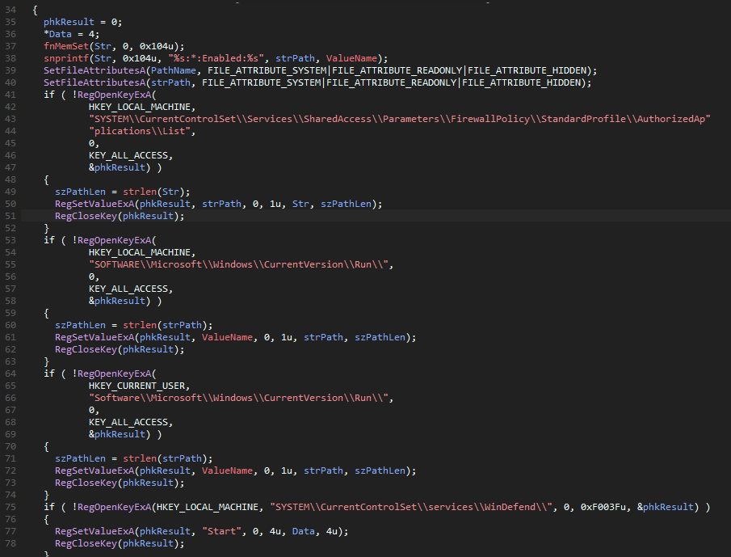

Once it's running from the other process, it will start a new thread that is
responsible for the whole logic of the sample. It starts by loading WSA and then
initializing the task array. After that, we get to initializing a TCP connection to
the IRC Server on address `220.181.87.80` and port `5050`. The infected computer
is then fingerprinted by getting the Windows version, the locale, the bitness, and the
privileges, then it proceeds to generate a string of that information like this:

```txt
UNK | XXX | 32 | U | RaNdOmM
W10 | US | 64 | A | cOfFeee
...
```

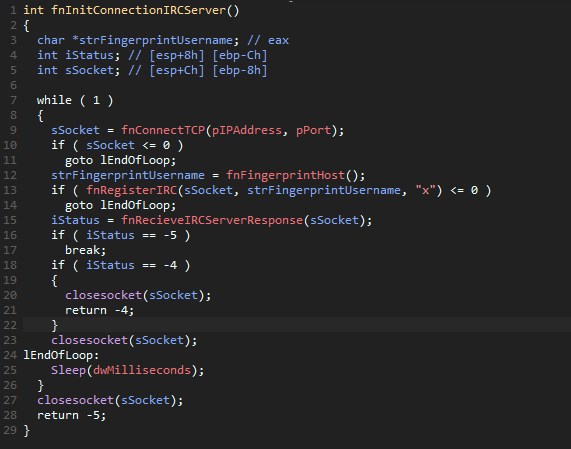

The `RegisterIRC` function then sends 2 commands to the IRC server:

```txt
NICK fingerprint\r\n
USER fingerprint x "" "x" :x\r\n
```

Finally we can step into `fnReceiveIRCServerResponse`. In short, it sets the socket timeout
to 600, reads whatever the IRC server sent, and parses it in `fnHandleIRCServerResponse`. In
there it has some logic to handle the following cases:

- `ERR_WELCOME_SERVER`
- `PING`
- `ERR_NICKNAMEINUSE`
- `RPL_TOPIC`
- `PRIVMSG`

Most of the commands are just general stuff you normally see in an IRC bot; however, `RPL_TOPIC`
and `PRIVMSG` are special; the `PRIVMSG` is targeting specifically our infected device, while
`RPL_TOPIC` likely targets all bots in the "network". If one of those special cases is met, it
removes the first dot (`.`) of the received string and calls `fnHandleTopicAndPrivMsg`, in there
we have some more parsing, and finally we get to the main piece of the sample: the command handler!

## Following the White Rabbit

Inside of the command handler, we can find out that the botnet supports the following commands:

- `.m.off` - Stop SMTP spamming binaries
- `.b.off` - Stop SMTP brute-force.
- `.bye` - Self delete
- `.j <IRC-channel>` - Join an IRC channel
- `.b <URL> <wordlist count>` - Start bruteforcing SMTP
- `.m.x <URL> <email count>` - Spread `.exe` via SMTP
- `.m.s <URL> <email count>` - Spread `.exe` via SMTP and download the word list.
- `.d [a|p|<CC>|x|u] <URL>` - Download a binary
  - `a` - Target all countries
  - `p` - Target only English-speaking countries.
  - `<CC>` - Target only specified country code
  - `x` - Download and execute binary
  - `u` - Update binary

For all commands, the URL is encrypted with RC4 using the hardcoded key `krt`. This is great and
all, but let's take a closer look to see how this thing works under the hood.

### SMTP Bruteforce

The first command we are going to take a look at is `.b`, it creates a new thread and takes
a URL and the number of word lists as arguments. Jumping into the function, we can see it creates
a string `<URL>/ok.php` and stores it in `strUrlOkPhp`, after that it will jump into an infinite
loop, where it will first download a number of word lists and then create 3000 threads that will
bruteforce the credentials of the given SMTP servers and send the valid ones to `strUrlOkPhp`.

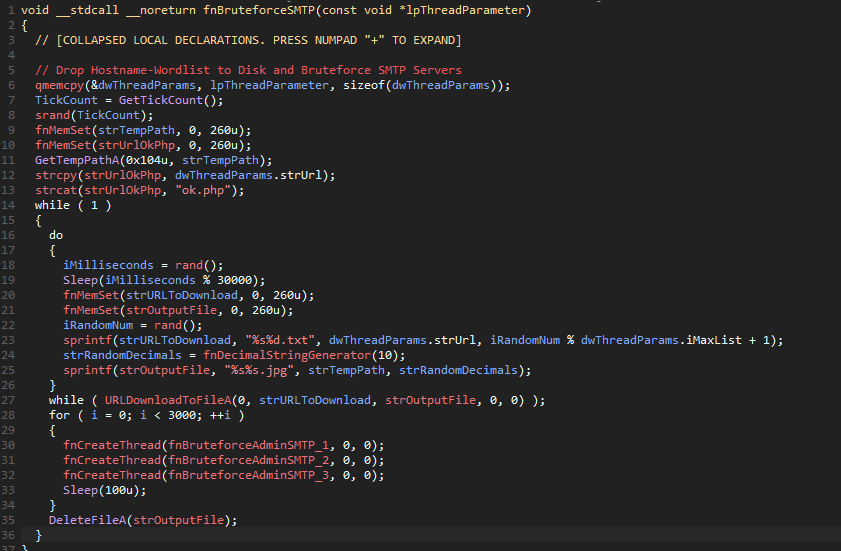

### You've Got Mail

Next up we have the `.m.x` and `.m.s` commands; these take a URL and the amount of emails as

their argument when their thread gets created. The command first downloads the binary specified
by the URL, and then if the command `.m.s` was called, it will download a list of credentials,
and then the normal control flow continues by manually creating an uncompressed `.zip` archive
and placing the target binary there. Finally, the contents of the archive are base64 encoded and
saved in a global variable, and we jump into an infinite loop. In the loop, the first thing that
happens is that an email list gets downloaded, and then 2000 threads are created, which start
sending files to email addresses. The only difference between `.m.x` and `.m.s` is that `.m.s`
will try to authenticate to the SMTP server before sending an email; the other will just attempt
to send mail without authenticating.

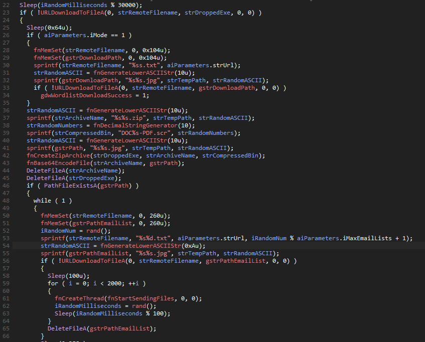

### Stager

Finally, the last command we have is the `.d`, it takes in a few arguments and, of course, starts
a new thread. However, before it starts a thread, it will check if the host machine is in the list
of targeted countries by sending an HTTP GET request to `http://api.wipmania.com/`,
this will return the public IP and the country code of the host. The sample then checks the
country code against the parameters that were passed in, `a` means it will accept any country
from its internal list, `p` means it will only accept English-speaking countries from its list
and finally the operator can specify a country code it wants to target. Additionally, we have
the flags `x` and `u`, the latter will update a file; however, if the file is our binaries mutex,
it will set the exit flag, causing the sample to exit the process.

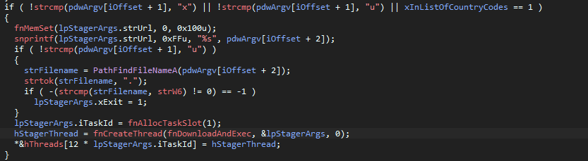

What the thread now will do is attempt to download the binary from the server using the
`InternetReadFile` API, if it succeeds, it will execute this new binary by creating a new process for it.

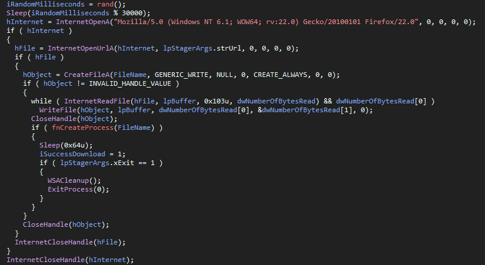

If the sample, however, fails to download the file via `InternetReadFile`, it will attempt the download
again, this time by using `URLDownloadToFileA`. Like the part above, it will try to execute the dropped binary by
creating a new process.

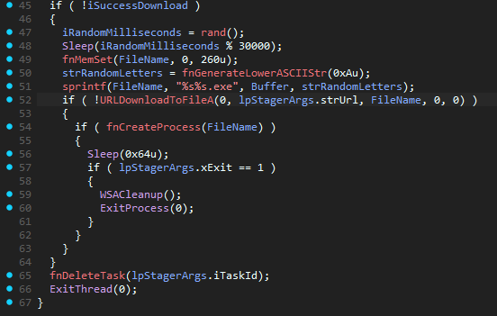

# Indicators of Compromise

Hashes:

```txt
MD5     - 2a6fab4cfce55c3815fc80607797afd0
SHA-1   - 85145b4c41775a308be0daa72535ad14aff42fad
SHA-256 - b45c7ac7e1b7bbc32944c01be58d496b5e765a90bd4b1026855dd44cea28cd12
```

Network/Command & Control:

```txt
220.181.87.80
```

Paths and Filenames:

```txt
%temp%\\M-50504503224255244048500220524542045\winsvc.exe
%userprofile%\\M-50504503224255244048500220524542045\winsvc.exe
%windir%\\M-50504503224255244048500220524542045\winsvc.exe
```

Mutex:

```txt
w6
```

Email Template:

```txt
Dear Customer
to see more details about your order please open the attachment and reply as soon as possible.
Thank you,
AWG Customer Service
```

# Final Words

That's it, folks; I hope you enjoyed the short read! If you would like to give me feedback or
if you see anything that is wrong in this post, don't be shy to reach out to me :).
I'd like to thank [struppigel](https://x.com/struppigel) again for pointing out my silly mistake.

Greetz to [Xyris](https://x.com/01Xyris), [cyb3rjerry](https://x.com/cyb3rjerry),
[nox](https://github.com/CaptainNox) and [eversinc33](https://x.com/eversinc33) and all my other friends! :D
