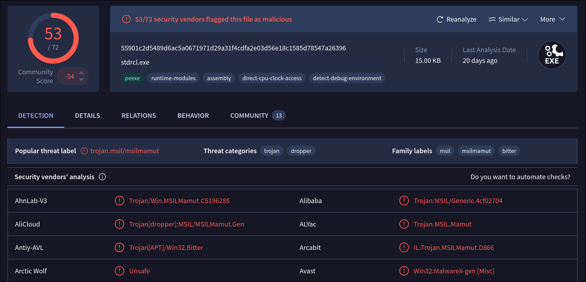
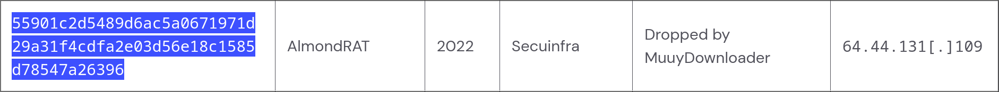
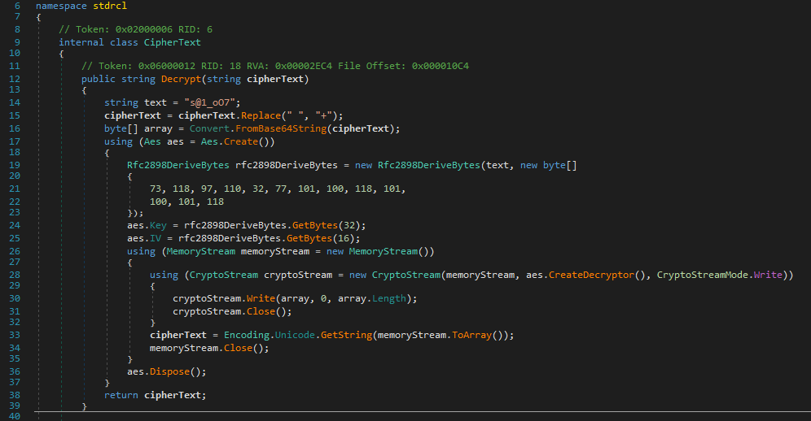
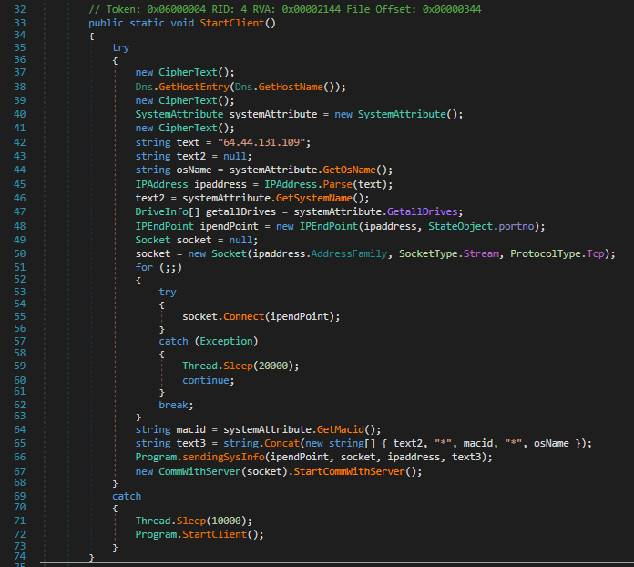
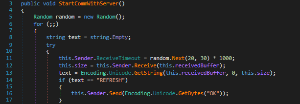
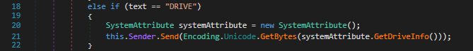
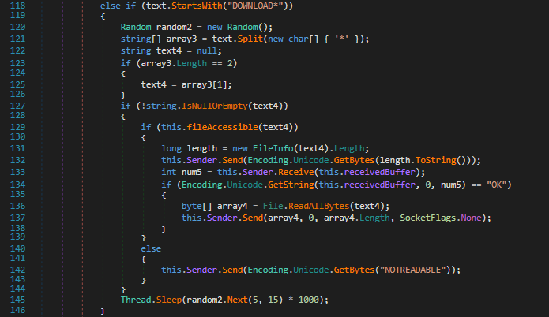
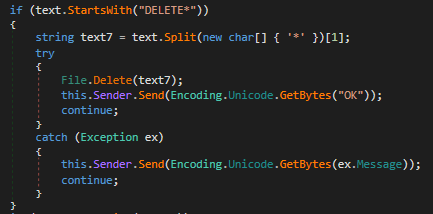
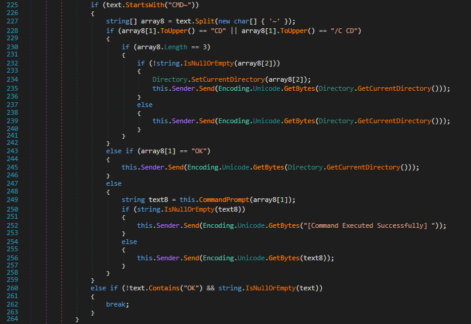

While browsing the OA-Labs Discord Server, I stumbled upon a few hashes being shared in the malware analysis chat. Out of curiosity, I picked one randomly and downloaded it from “virus.exchange” . Upon opening the sample in DiE (Detect it Easy) we determine it is an .NET sample and that it is likely not packed. After letting windows defender scan the file, it found no threat. Uploading the sample to VirusTotal, amongst the flags we find the sample is labeled as “Trojan.Win32.MSILMamut.4\!c” by most of the Anti-Virus products.

Further research led me to finding the sample on [MalwareBazaar](https://bazaar.abuse.ch/sample/55901c2d5489d6ac5a0671971d29a31f4cdfa2e03d56e18c1585d78547a26396/), the Tags labeled the sample as “AlmondRAT” and related to the group “Bitter”. Due to past experience of the samples being wrongly labeled on MalwareBazaar, I researched further and sure enough, I found the samples hash in the article linked [here](https://www.threatray.com/blog/the-bitter-end-unraveling-eight-years-of-espionage-antics-part-two).   

However, after confirming that the sample is indeed AlmondRAT, I did not read the article due to me still wanting to reverse engineer the sample myself.

Having that out of the way, I opened the sample in DnSpyEx, and found the file was originally called “stdrcl.exe” and consists of one namespace with a matching name. The namespace consists of the following five classes:

- CipherText  
- CommWithServer  
- Program  
- StateObject  
- SystemAttribute

If we open the Program class, we quickly find that the strings are encrypted with a method from the class “CipherText”, this class consists of only one method called “Decrypt(string cipherText)”, since it uses only standard system namespaces, we can easily copy out the decryption method and use it to decrypt the strings. Due to the fact that there were not many strings, I decided to decrypt each string one-by-one. After that was done, I proceeded with reverse engineering the Program class.

The “Main” function of the program class starts off by creating a mutex with the value `saebamini.com SingletonApp` and then calling the “StartClient” function. There we find the sample attempts to fingerprint the host by enumerating the hostname, OS-name, system-name, drives and MAC-ID. Once that is done, the sample attempts to connect to `64.44.131.109` on port `33638` via TCP, if the connection fails, it will wait 20 seconds and try again infinitely. Once the connection to the server is established, it will send the enumerated data over and finally call the method “StartCommWithServer” from the “CommWithServer” class.

## Commands

Taking a look at “StartCommWithServer”, we quickly find out it is the command handler for the communication with the C2 server. The supported commands are:

- `REFRESH`  
- `DRIVE`  
- `DIR*`  
- `DOWNLOAD*`  
- `UPLOAD*`  
- `DELETE*`  
- `CMD~`

The exact functionality of these commands is broken down in the following sections.

### Refresh

The simplest command in the handler, it only responds with “OK” to the server.

### Drive

The DRIVE command enumerates the name, the size and the drive type, and sends it to the C2 Server in the following format: `name*driveType*totalSize|`

### Dir\*

As expected, the `DIR*` command will enumerate all the files and directories in the current directory. It will send the results in batches of 5. The results are formatted as follows:

- `FILE>filename|timestamp|fileinfo?`
- `PATH>directory|timestamp|?`

After all results have been sent, a final `*|END|*` marker is sent.

### Download\*

This command takes a path as an argument and checks if it is accessible, if that is the case, it will read the file into an array and send it to the server. If the file is not accessible, it will send the string “NOTREADABLE” to the server.

### Upload\*

`UPLOAD*`, as the command above, takes a path as an argument. The handler first receives 8 bytes from the server, if that is successful an “OK” is sent and the full file is received and written to the given path. If the file exists a timestamp will be prepended to the filename. Once the full file has been received, a “SUCCESS” is sent to the server. If the procedure fails, an “NOTOK” is sent.

### Delete\*

The `DELETE*` command takes a full path to a file as an argument and attempts to delete the specified file. If it succeeds it will send an “OK”, otherwise the exception description is sent to the server.

### Cmd\~

As the name implies, the `CMD~` command executes a cmd command and returns its output to the server. If the command has no output it will return “\[Command Executed Successfully\]”. If the command is a `CD` or `/C CD`, the sample will just change the directory to the one specified in the argument.

## Indicators of Compromise

- Mutex: `saebamini.com SingletonApp`
- C2 Server: `64.44.131.109`
- Sha256: `55901c2d5489d6ac5a0671971d29a31f4cdfa2e03d56e18c1585d78547a26396`
