## Beating Instruction Substitution to Reverse Engineer a VM

A few days after publishing the TadpoleVM blog post, I received a direct message on Discord from Garuda. They asked me if I want to reverse their crackme with a virtual machine. After accepting the challenge, I set out to create a disassembler and recover the expected key. In this post, I will fully analyse the given binary, write a deobfuscation script and recover the valid key input.

## Static Analysis

Upon opening the binary in IDA and locating the VM handler, I found out the VM consisted of 14 instructions. I started by reverse engineering the opcodes, first sweeping up the simple ones. The first Instruction I noticed was the VM_EXIT instruction by its “return” statement in the decompiler, which ultimately exits out of the interpreter loop. The next instruction I noticed is the VM_IO, these I identified by the format strings used as an argument in the functions at 0x140001020 and 0x140001080. Stepping into these functions we find that the first is a forwarded call to “`printf`” and the latter a call to “`scanf`”.

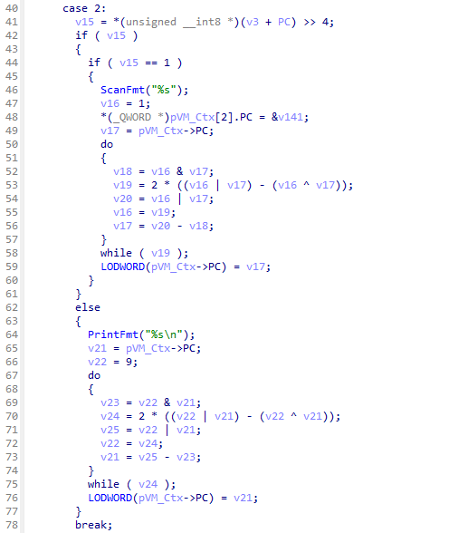

The next thing that caught my attention were the do-while loops in every instruction-handler of the switch-case. I discovered the purpose of this code block by copying the do-while loop into an empty file and rewriting the block as a function, which takes the missing variables _v21_ and _v22_ as an argument because these values differ in every occurrence of this snippet in the decompiler. In the main function I made a simple for-loop which calls the function with some simple values and finally compiled the program. Upon compiling the snippet, the function seemed to always return the sum of the passed in values, thus I concluded it is likely a binary adder implementation.

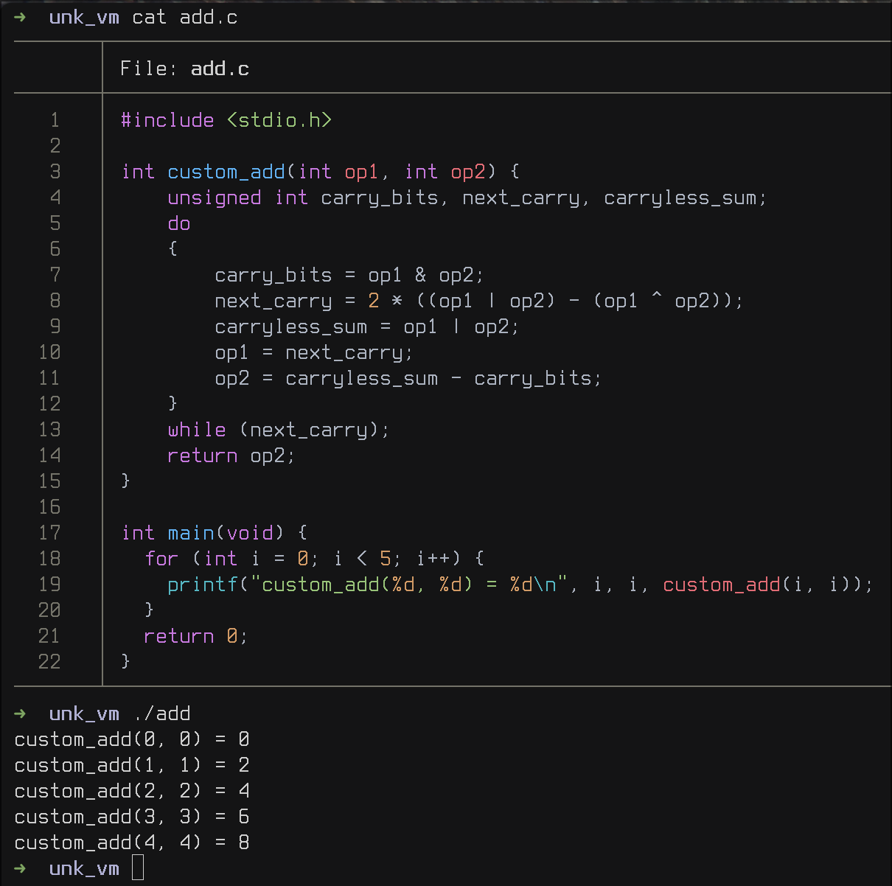

After learning that I have to deal with instruction-substitution, due to the fact that more simple operations were being replaced with more complex equivalents, I started writing a standalone Python script to simplify these obfuscated operations.

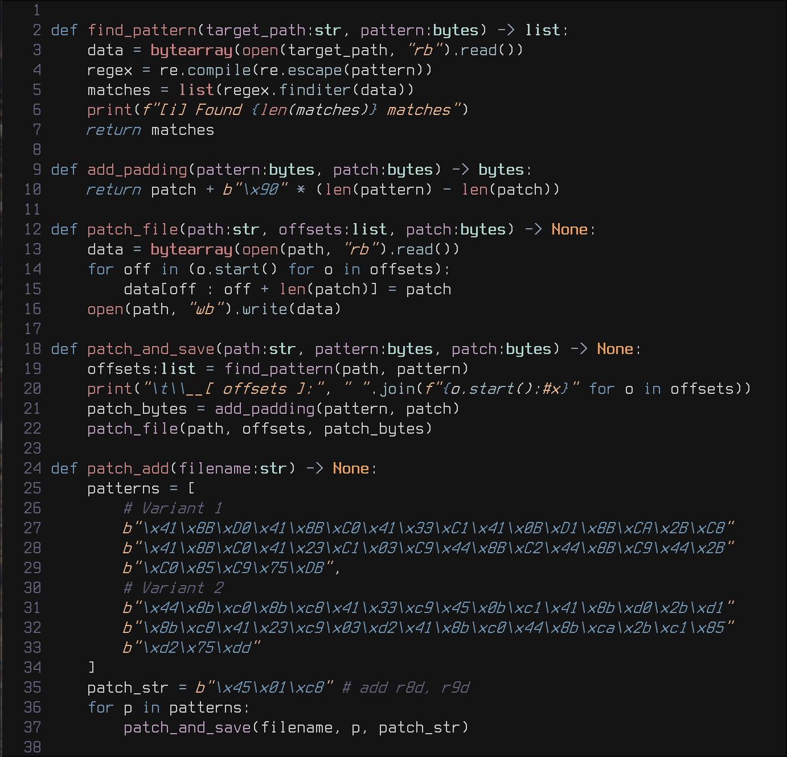

Implementing the above script was pretty straight forward with IDA’s option to synchronize the disassembly with the decompilation view. I just needed to find the obfuscated operation in the decompiled code and quickly saw what assembly code was a part of that operation. After some time of staring at the disassembly of all the occurrences of that code snippet, I noticed that all the code is doing is adding R8D with R9D and with that the script was easily implemented.

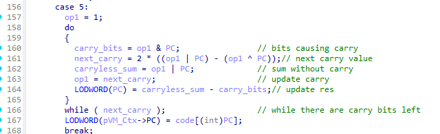

Running the script and opening IDA again, I managed to quickly find the VM_Context structure along with the instruction pointer that was being updated in every instruction handler of the switch-case statement. The VM_Context structure consists of a 32-bit wide instruction pointer, a pointer to the virtualized code and 16 64-bit wide registers.

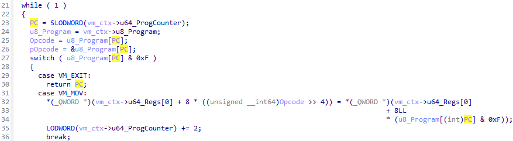
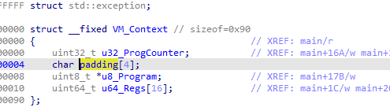

Additionally, I quickly found the VM_JCC instructions along with the VM_JMP instruction as its instruction handler only set the instruction pointer to the given value.

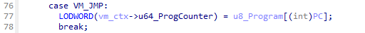

Following that I also discovered the VM_ADD and VM_SUB operations due to the quite obvious add operation in the if-statement in both. Since those handlers also referenced something at an unknown offset in the VM_Context structure, I added an array of length 0x10 to the VM_Context structure of the type `uint64_t` and labeled it “regs”.

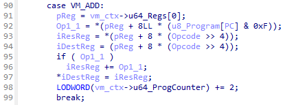
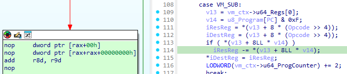

After adding the register array to the structure, finding instructions such as VM_INC, VM_MOV, VM_MOV_IMM, VM_MOV_MEM and VM_AND was trivial. The next issue was the for-loop with some obfuscated OR-expressions in the decompilation, applying the same technique as before I found out it is an OR-operation and thus updated my deobfuscation script with the following function:

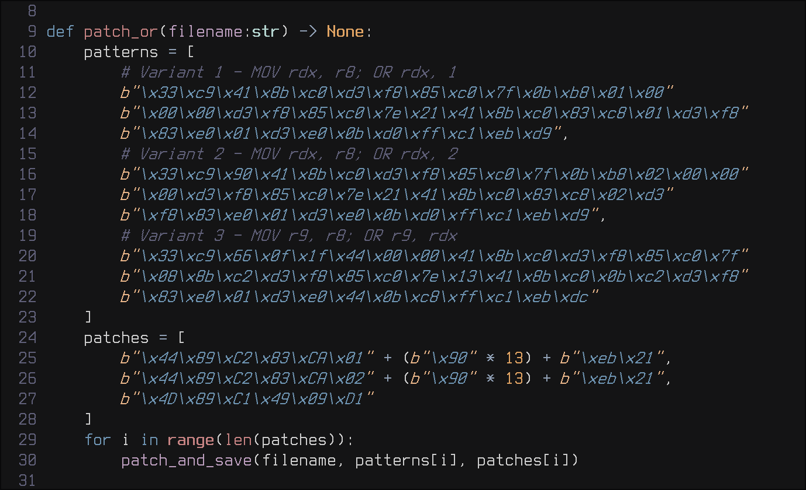

Finally, after executing the script, I managed to uncover the last two instructions: VM_OR and VM_CMP.

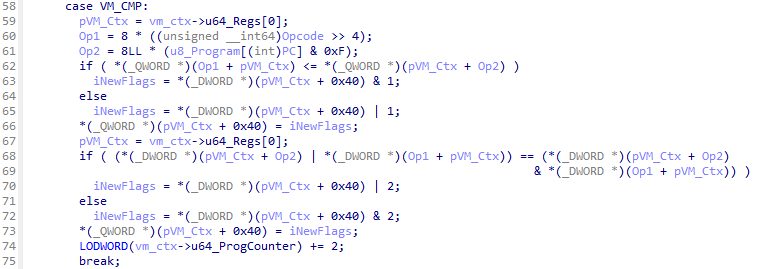

## Dumping the Virtualized Code

After understanding all the opcode handlers, I decided it was time to debug the binary. Therefore in IDA, I first located the addresses on which the pointer of the virtualized code and the virtual machine’s program counter is loaded into registers. I managed to accomplish this by, again, synchronizing the decompiler view with the disassembly view.

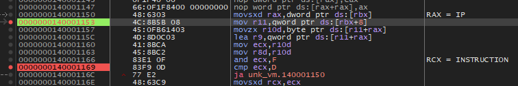

Then I opened the binary in the debugger, disabled ASLR, located the above addresses and the virtualized code in the memory dump. Due to the fact that the code seemed suspiciously small, I decided to take the dumb route and “manually” trace the program by setting a breakpoint on the operation after “opcode & 0xF”. Hitting run now would allow me to step through the virtualized code and take note of all instructions in order. Upon hitting the error message, I restarted the process and inverted the jumps (e.g. from JZ to JNZ). On the third run, I was able to get the success message meaning I had to patch/invert two jumps in order to complete the first task I was given.

## Reverse Engineering the Virtualized Code

After determining that, and in the process figuring out that the program is indeed short, I dumped the memory region to disk, wrote a disassembler in python and thus finished the second task given.  
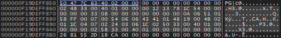

Upon running the disassembler and cleaning up the output I had the following result:

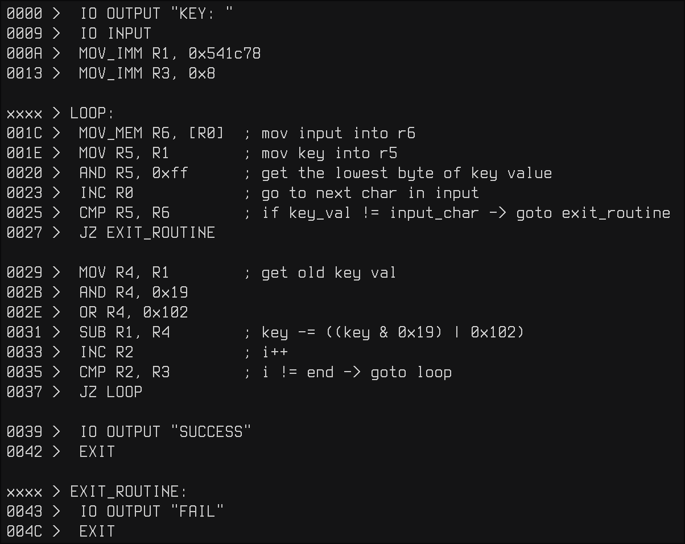

As we can see, the key checking routine compares each character of our input with a key that mutates on each iteration of the loop. To get the key, I implemented the key-check routine in python and got the following output:  
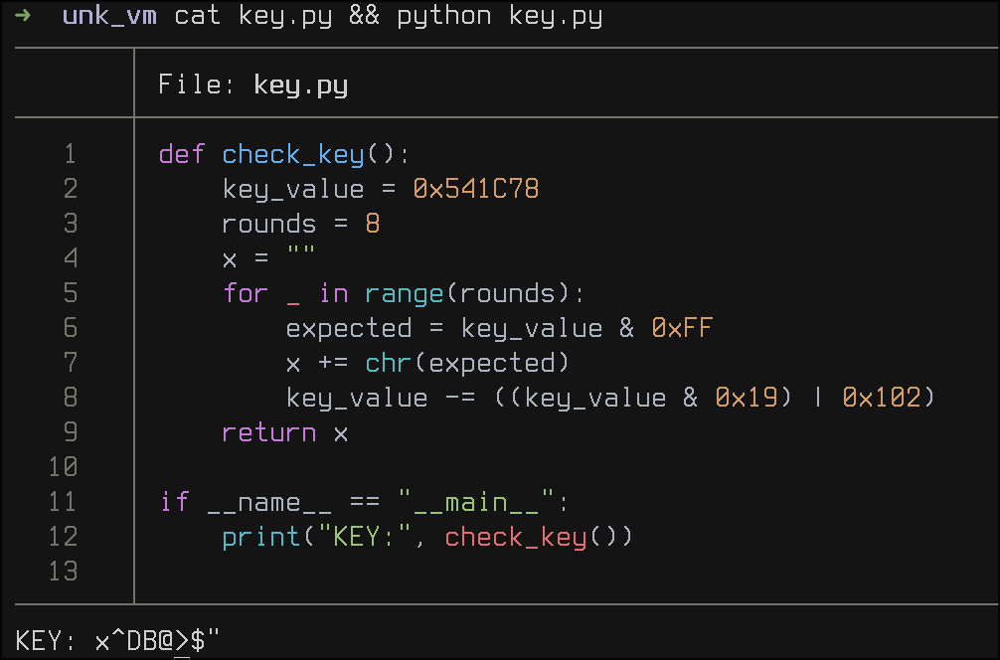

Upon entering the generated key in the crack-me, I got the correct output!

## Conclusion

I hope you, the reader, enjoyed this post and maybe learned something new. If you have any questions related to the challenge, please feel free to contact the crackme’s author on discord, his username is “x32dbg”. All the scripts as well as the dumped virtualized code can be found on github in the repo [https://github.com/DeLuks2006/Garudas-VM](https://github.com/DeLuks2006/Garudas-VM/). Finally I'd like to thank [darbonzo](https://bsky.app/profile/darbonzo.bsky.social) for reviewing yet another post of mine.
