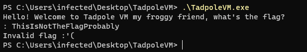
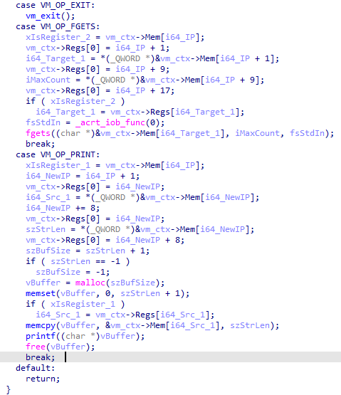
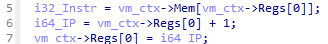
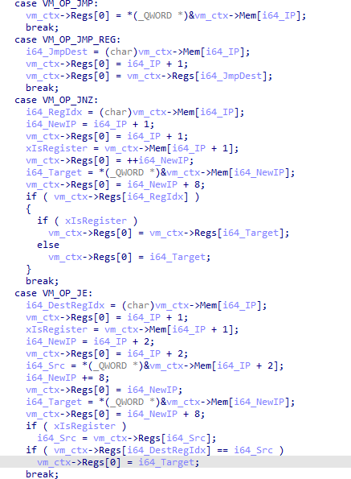
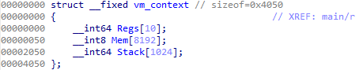
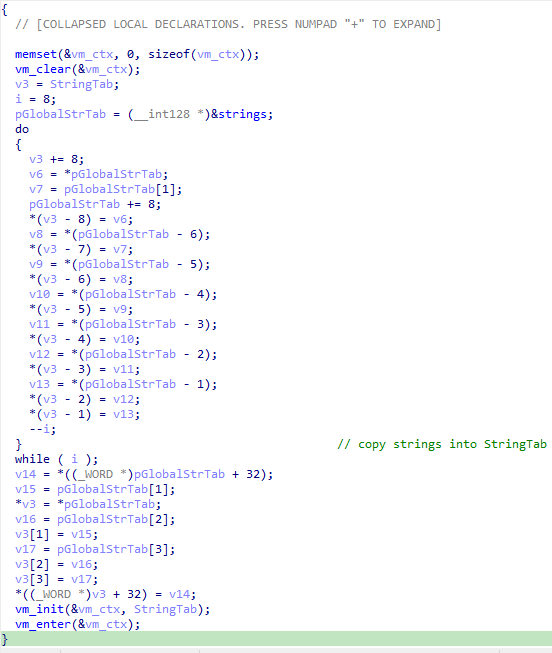
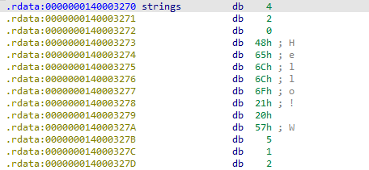
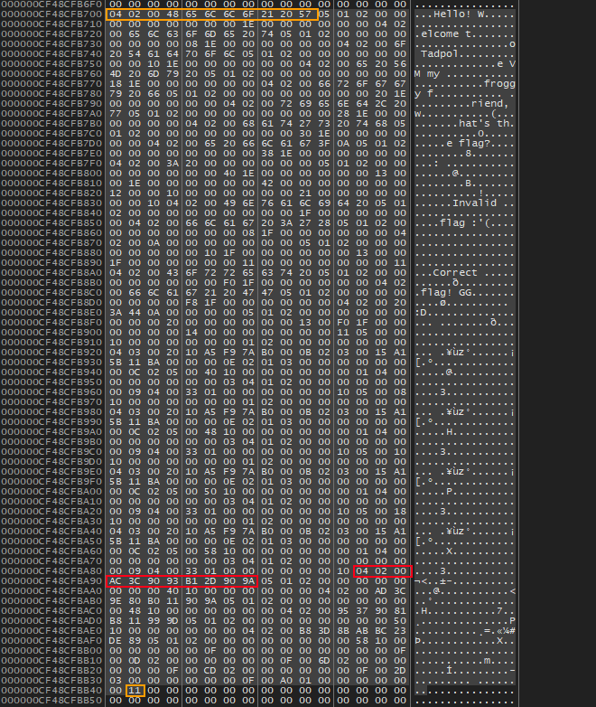

## Reverse engineering a virtual machine with a custom instruction set

With the rising popularity of virtual machines as an anti-analysis technique such as [VMProtect](https://vmpsoft.com/) & [Themida](https://www.oreans.com/Themida.php), more and more malware samples as well as CTF-challenges are using virtual machines with custom instruction sets to make analysis of programs harder. My friend [0xLegacyy](https://x.com/0xLegacyy) made a small CTF-challenge “TadpoleVM” for our team to practice reverse engineering virtualized targets. In this post, I will fully analyse the given binary and implement a disassembler to recover the VM’s semantics, to ultimately find the flag that satisfies the program's checks. This was my first ever VM reverse-engineering project and I learned a lot of ways to improve my approach along the way. This post is therefore a cleaned up summary of the techniques I used. :)

Note: This post will not cover how virtual machines work, for that, please read the following and come back later: [https://www.jmeiners.com/lc3-vm/](https://www.jmeiners.com/lc3-vm/) 

## Static Analysis

Upon executing the binary we are greeted with the following prompt:  



Loading the binary in IDA we are greeted with a surprisingly small amount of functions. Going through them, I found a function which by the looks of its control flow graph, resembled a VM interpreter by its VM-dispatcher and instruction handlers therefore I later labeled the function “vm\_interpreter”. This function is the heart of the custom virtual machine, like many other VM’s, it consists of a huge switch statement that decodes the instructions of the virtualized code and modifies the virtual machines state accordingly. 

The VM consists of 20 variable length instructions since the switch statement has only 20 cases if we don’t count the default case. The instructions that immediately stick out are VM\_OP\_EXIT, VM\_OP\_FGETS, VM\_OP\_PRINT due to their calls to EXIT(), FGETS() and PRINTF() as well as the logical operations AND, NOT, OR, XOR since these handlers perform said operations on 2 operands and store the result of those somewhere. These operations stick out especially because, not only are they common but could also be a part of the key checking logic.



Upon further inspection I found the instruction pointer before the switch statement since it was the only variable that was always incremented before the actual instruction is decoded & interpreted.   



With the help of that discovery I managed to uncover the instructions VM\_OP\_JMP, VM\_OP\_JMP\_REG, VM\_OP\_JNZ and VM\_OP\_JE since these directly modify the instruction pointer:  



Due to the fact that virtual machines often save context in a structure that contains pointers to the registers, stack and memory. Based on the usage of the value following the instruction pointer, I concluded it was the stack pointer. Therefore all instructions using it are modifying the stack in some way. With that information I found the Instructions VM\_OP\_PUSH, VM\_OP\_POP, VM\_OP\_CALL and VM\_OP\_RET. For this specific virtual machine, the VM context is structured like in the image below:  



With the instruction pointer and stack structures discovered, the behaviour of the remaining opcodes is easily understood, therefore I moved on to the other functions of the binary. Starting with the main function, it first creates an object of the VM-context structure and clears its contents.   



Then an array in the local scope of the function is populated with the content of the memory region starting at “0x130003270”, upon inspection, it consists of the bytes 4, 2, 0 followed by 8 characters of a string and then the bytes 5, 1, 2, after some debugging I found that this memory region is the virtualized code, the bytes “04 02 00 \<string\>” copy the first 8 bytes of a string into the second register in our register array.  



Next, in the “vm\_init” function, the virtualized code is copied into memory of the VM-context structure, the instruction pointer is set to 0x38D and the stack pointer is set to 0\. Finally it calls the “vm\_enter” function, which starts an infinite loop that executes a single opcode at a time using the “vm\_interpreter” function.

## Analysis of the Virtualized Code

Dumping the virtualized code was pretty straight forward because of the previously reversed “vm\_init” function. Running the binary in the debugger I located the VM-Interpreter and then in the dispatcher I encountered the following code:

```asm
push    rdi
sub     rsp, 20h
mov     rax, [rcx]                  ; PC
mov     rdi, rcx                    ; VM_CTX ptr  
movzx   edx, byte ptr [rax+rcx+50h] ; Instruction 
lea     r8, [rax+1]                 ; <- Breakpoint
mov     [rcx], r8
cmp     edx, 13h        ; switch 20 cases
```

After putting a breakpoint on the LEA instruction and following the RAX+RCX+0x50 in the memory dump, I found the entry of the virtualized code. Then I calculated the base address by subtracting the current address of the code with the offset to the entry point. Taking note of that, I scrolled a little bit up in the dump and found the end of the code. Having both the start and the end of the virtualized code, I dumped it to a file and started working on a disassembler.



After a few days of writing the disassembler while being dead tired, making stupid mistakes, and starting over a few times — I managed to write one without errors, which can be found here: [https://github.com/DeLuks2006/BullFrog](https://github.com/DeLuks2006/BullFrog) 

Upon running the disassembler, I proceeded to clean up the output manually, ending up with the following:

```asm
0x0000 > GET_INPUT():
0x0000 >     MOV R1, "Hello! Welcome to Tadpole VM my froggy friend, what's the flag?\n: "
0x00fb >     MOV [0x1e00], R1
0x010e >     PRINT 0x1e00, len=0x42
0x0120 >     FGETS 0x1000, 0x21
0x0132 >     RET

0x0133 > FAILURE():
0x0133 >     MOV R1, "Invalid flag :'(\n"
0x017a >     MOV [0x1f00], R1
0x018d >     PRINT 0x1f00, len=0x11
0x019f >     EXIT

0x01a0 > SUCCESS():
0x01a0 >     MOV R1, "Correct flag! GG :D"
0x01e7 >     MOV [0x1ff0], R1
0x01fa >     PRINT 0x1ff0, len=0x14
0x020c >     EXIT

0x020d > CHECK_CHUNK(offset:int):
0x020d >     MOV R1, [0x1000 + offset]
0x0220 >     MOV R2, 0xb00b07af9a51020
0x022b >     ADD R2, 0xba115ba115
0x0236 >     XOR R1, R2
0x0241 >     NOT R1
0x0243 >     MOV R3, [0x1040 + offset]
0x0256 >     SUB R3, R1
0x0261 >     JNZ R3, FAILURE
0x026c >     RET

0x038d > MAIN():
0x038d >     MOV R1, 0x9a902db193903cac ; key chunk 1
0x0398 >     MOV [0x1040], R1
0x03ab >     MOV R1, 0x9a9011b0809e3cad ; key chunk 2
0x03b6 >     MOV [0x1048], R1
0x03c9 >     MOV R1, 0x9d9911b881903795 ; key chunk 3
0x03d4 >     MOV [0x1050], R1
0x03e7 >     MOV R1, 0x89de23bcab8b3db8 ; key chunk 4
0x03f2 >     MOV [0x1058], R1
0x0405 >     CALL GET_INPUT()
0x040f >     CALL CHECK_CHUNK(0x00)
0x0419 >     CALL CHECK_CHUNK(0x08)
0x0423 >     CALL CHECK_CHUNK(0x10)
0x042d >     CALL CHECK_CHUNK(0x18)
0x0437 >     CALL SUCCESS()
0x0441 >     EXIT
```

Since the integer chunk check consists of simple boolean operations, we can retrieve the key using the following formula:

$$
\begin{align*}
    \lnot (\text{input chunk} \oplus R_2) &= \text{key} \\
    \text{input chunk} \oplus R_2 &= \lnot \text{key} \\
    \text{input chunk} &= (\lnot \text{key}) \oplus R_2
\end{align*}
$$

Finally, this formula can be implemented in Python as follows, producing the expected input:
```python
def decode_flag():  
    key_chunks = [
        0x9a902db193903cac,  
        0x9a9011b0809e3cad,  
        0x9d9911b881903795,  
        0x89de23bcab8b3db8,  
    ]

    R2 = (0x0b00b07af9a51020 + 0x0ba115ba115) & ((1 << 64) - 1)

    flag_bytes = b""  
    for key in key_chunks:
        chunk = ((~key) & ((1 << 64) - 1)) ^ R2  
        flag_bytes += chunk.to_bytes(8, "little")

    return flag_bytes.decode("ascii")
```

## Conclusion

This concludes my first attempt at reverse engineering a virtual machine with a custom instruction set, it was a really fun and educational challenge, which made me develop a better approach to reversing virtual machines. I hope you, the reader, enjoyed this rather short blog post and maybe learned something new. Finally I’d like to thank a couple of people that helped me during the reverse engineering process of the binary and during the making of this post:

- [0xLegacyy](https://x.com/0xLegacyy) \- Hints while reversing the binary  
- [Darbonzo](https://bsky.app/profile/darbonzo.bsky.social) \- Help while creating the disassembler & grammar police  
- [Ihor](https://x.com/glitchingcore) & [tmpvec](https://x.com/tmpvec) \- General feedback about the post

